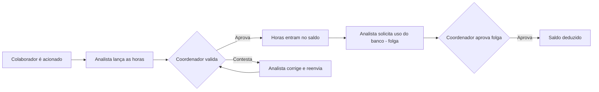
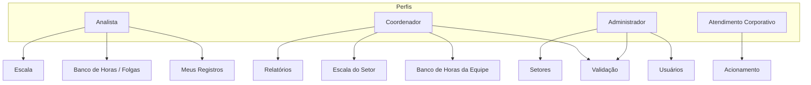
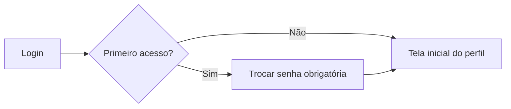
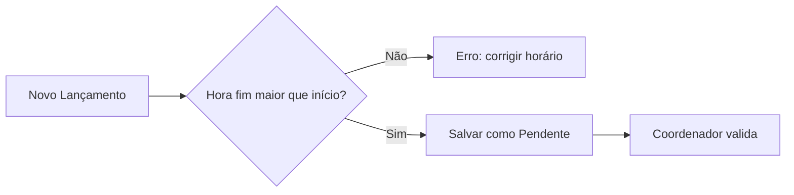
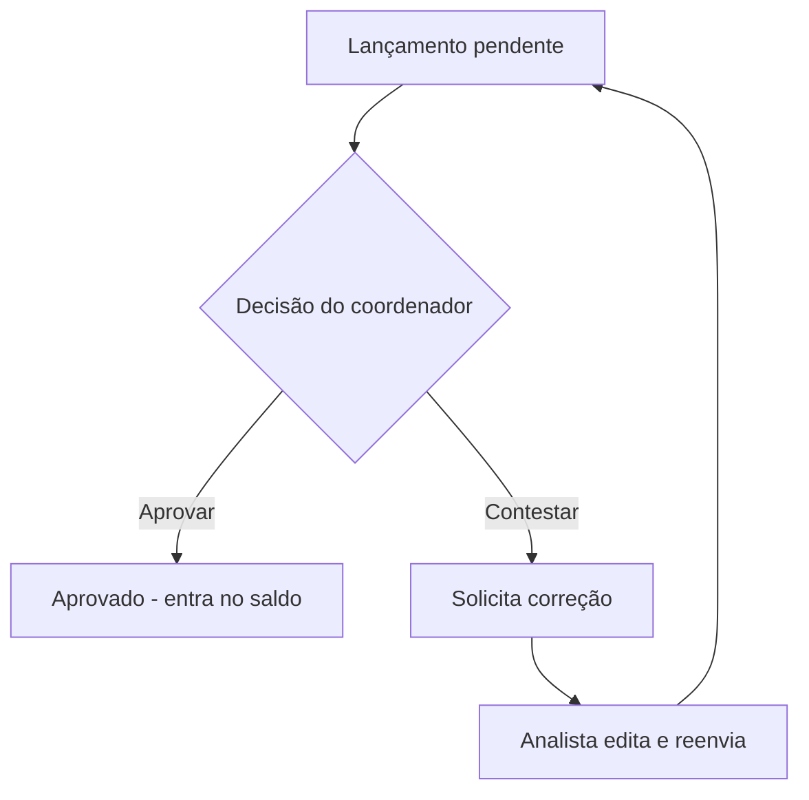
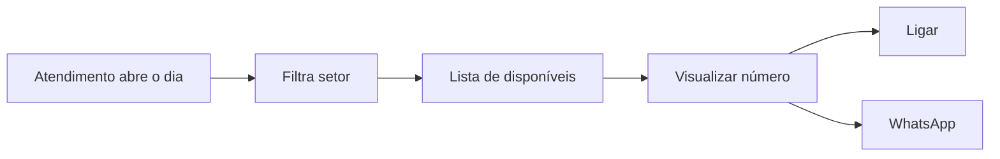

# BH Pulse — Manual de Uso

**Sistema de Banco de Horas · Hostweb**
Versão 1.0.0 · Documento de referência para usuários e gestores

> 💡 **Sobre as imagens:** os diagramas (fluxogramas e mapas) são renderizados automaticamente
> em visualizadores Markdown como GitHub e VS Code. As capturas de tela são carregadas de
> `docs/img/` — siga o **[Guia de captura](docs/GUIA-SCREENSHOTS.md)** para gerá-las; enquanto
> os arquivos não existirem, os espaços de imagem aparecem como ícone quebrado (esperado).

---

## Sumário

1. [Visão geral](#1-visão-geral)
2. [Perfis de acesso](#2-perfis-de-acesso)
3. [Primeiro acesso e login](#3-primeiro-acesso-e-login)
4. [Funcionalidades do Analista](#4-funcionalidades-do-analista)
5. [Funcionalidades do Coordenador](#5-funcionalidades-do-coordenador)
6. [Funcionalidades do Administrador](#6-funcionalidades-do-administrador)
7. [Funcionalidades do Atendimento Corporativo](#7-funcionalidades-do-atendimento-corporativo)
8. [Regras de cálculo (CLT)](#8-regras-de-cálculo-clt)
9. [Feriados](#9-feriados)
10. [Perguntas frequentes](#10-perguntas-frequentes)

---

## 1. Visão geral

O **BH Pulse** controla o **banco de horas** decorrente de **acionamentos** (horas extras de
plantão/sobreaviso voluntário) dos colaboradores da Hostweb. O fluxo central é:

**Conceitos-chave:**

| Termo | Significado |
|---|---|
| **Acionamento** | Chamado fora do horário que gera hora extra a ser lançada |
| **Lançamento** | Registro de horas extras feito pelo analista (data, horário, chamado, motivo) |
| **Saldo** | Total de horas aprovadas disponíveis no banco do colaborador |
| **Folga / Uso do banco** | Solicitação do analista para usar o saldo (folga total/parcial) |
| **Escala de disponibilidade** | Marcação **voluntária** dos dias/turnos em que o colaborador aceita ser acionado |
| **Validação** | Aprovação ou contestação dos lançamentos pelo coordenador |

> ⚠️ A escala é **disponibilidade voluntária** e **não** gera remuneração de sobreaviso.
> O colaborador só é remunerado pelas **horas efetivamente trabalhadas** quando acionado e
> com o lançamento aprovado.

---

## 2. Perfis de acesso

O sistema usa **perfis cumulativos** — um mesmo usuário pode ter mais de um perfil
(ex.: Analista + Atendimento). O menu exibido depende dos perfis atribuídos.

| Perfil | O que faz | Menus visíveis |
|---|---|---|
| **Analista** | Lança horas extras, acompanha saldo, solicita folgas, marca disponibilidade | Meus Registros, Banco de Horas, Escala |
| **Coordenador** | Valida/contesta lançamentos e folgas dos setores que coordena; consulta relatórios | Validação, Banco de Horas, Escala, Relatórios |
| **Administrador** | Tudo do coordenador + gestão de usuários e setores | Todos os menus de gestão |
| **Atendimento Corporativo** | Visualiza voluntários disponíveis e os aciona por telefone/WhatsApp | **Apenas** Acionamento |

> 🔑 **Coordenador multi-setor:** um coordenador pode coordenar **vários setores**
> (definidos em "Setores que coordena"), independentemente do seu setor de lotação.

---

## 3. Primeiro acesso e login

1. Acesse o sistema pela URL fornecida pela TI.
2. Informe **e-mail** e **senha inicial** (recebidos por e-mail ou repassados pelo administrador).
3. No **primeiro acesso**, o sistema obriga a **troca de senha** por uma senha pessoal.

> Esqueceu a senha? Solicite ao **administrador** uma redefinição (menu Usuários → Resetar senha).

---

## 4. Funcionalidades do Analista

### 4.1 Meus Registros

Tela inicial do analista. Exibe:

- **KPIs:** Saldo BH, Aprovados, Pendentes, Recusados/Contestados.
- **Filtros:** por período (De/Até) e por status.
- **Tabela** de lançamentos com data, horário, chamado, duração e status.

**Status possíveis:**

| Status | Cor | Significado |
|---|---|---|
| Pendente | Âmbar | Aguardando validação do coordenador |
| Aprovado | Verde | Horas creditadas no saldo |
| Contestado | Laranja | Coordenador pediu correção — **editável** pelo analista |
| Recusado | Vermelho | Lançamento não aceito |

### 4.2 Novo Lançamento

Botão **+ Novo Lançamento**. Campos:

- **Data** do acionamento.
- **Início** e **Fim** — digitados em formato militar 24h (ex.: `0830` vira `08:30`).
- **Chamado** (ex.: CHD-1234) e **Motivo**.
- **Feriado:** detectado **automaticamente** ao informar a data. Se a data for feriado
  nacional, aparece um aviso *"Feriado detectado: …"* e o cálculo usa o multiplicador dobrado.

### 4.3 Banco de Horas (uso do saldo / folgas)

Permite **solicitar o uso do saldo** acumulado. Três modalidades:

| Tipo | Dedução do saldo |
|---|---|
| **Dia inteiro** | Jornada completa (expediente − almoço) |
| **Meio período (Manhã)** | Do início do expediente até o início do almoço |
| **Meio período (Tarde)** | Do fim do almoço até o fim do expediente |
| **Personalizado** | Intervalo de horário escolhido |

A tela mostra **3 cartões** (Total Aprovado, Deduções, Saldo Disponível) e um **histórico**
das solicitações com seus status. A solicitação passa por aprovação do coordenador.

### 4.4 Escala de Disponibilidade

Calendário onde o analista marca os dias/turnos em que **se disponibiliza** voluntariamente
para acionamento. É possível marcar **mais de um turno**:

- **Manhã**, **Tarde**, **Noite** (combináveis).
- Marcar os três colapsa automaticamente para **"Dia todo"**.

> A disponibilidade **não obriga** atendimento nem gera pagamento — serve para o time de
> Atendimento Corporativo saber a quem recorrer.

---

## 5. Funcionalidades do Coordenador

### 5.1 Validação

Centro de aprovações. Duas abas:

- **Lançamentos:** cada item pode ser **Aprovado** ou **Contestado**.
  - **Contestar** abre uma caixa "Solicitar correção" — a mensagem volta ao analista, que
    edita e reenvia (o lançamento retorna a "Pendente").
- **Folgas:** solicitações de uso do banco com **Aprovar** / **Recusar**.

> Um item fica visível para o coordenador apenas se o colaborador pertence a um
> **setor que ele coordena**.

### 5.2 Banco de Horas da Equipe

Visão **somente leitura** de todos os lançamentos dos setores coordenados, com filtros por
colaborador, status e período. Exibe o **Valor CLT** calculado (visível só para gestão).

### 5.3 Escala do Setor

Calendário consolidado da disponibilidade da equipe:

- **Filtro por setor** (pills coloridas).
- Bolinhas coloridas por setor em cada dia.
- Painel **"Disponíveis no Mês"** agrupado por setor.
- **Exportar mês** em CSV (compatível com Excel).

### 5.4 Relatórios

KPIs gerenciais: total de acionamentos, horas aprovadas, **custo CLT total**, média por
acionamento, distribuição por tipo e por mês, e ranking por colaborador. Referência de
retorno financeiro deve usar o **CDI** como benchmark quando aplicável.

---

## 6. Funcionalidades do Administrador

O administrador tem acesso a tudo do coordenador, **mais**:

### 6.1 Usuários

Cadastro e edição de colaboradores. No cadastro:

- **Dados:** nome, e-mail, **perfis** (cumulativos), **setor de lotação**, **telefone** (opcional).
- **Setores que coordena:** aparece quando o perfil **Coordenador** está marcado.
- **Jornada & CLT:** salário bruto, **adicional atrativo (R$)**, início/fim de jornada, almoço.
- **Acesso:** senha inicial com **gerador automático**, opção de **exigir troca no 1º acesso**
  e **enviar acesso por e-mail** (via Microsoft 365).

Ações na lista: Editar, Resetar senha, Desativar/Reativar, Arquivar (ex-colaborador).

### 6.2 Setores

Cadastro de setores (equipes). Permite renomear e excluir.
**Setores com colaboradores vinculados não podem ser excluídos** (proteção de integridade).

---

## 7. Funcionalidades do Atendimento Corporativo

Perfil dedicado ao **acionamento dos voluntários**. Vê **apenas** o menu **Acionamento**.

A tela espelha a Escala do Setor, com foco em acionar:

- **Filtro por setor** e calendário com bolinhas coloridas.
- Painel **"Disponíveis no Mês"** agrupado por setor.
- Ao clicar em um dia → lista dos disponíveis. Em cada colaborador, o botão
  **"Visualizar número de telefone"**:
  - Se houver telefone → revela o número + botões **📞 Ligar** e **WhatsApp** (abre conversa direta).
  - Se não houver → exibe **"Sem número cadastrado"**.
- **Exportar mês** em CSV (inclui telefone).

> O Atendimento Corporativo enxerga voluntários de **todos os setores**.

---

## 8. Regras de cálculo (CLT)

O valor das horas extras segue a base legal, calculado **hora a hora**.

**Base horária:** `salário bruto ÷ 220h`

**Multiplicadores aplicados:**

| Período | Diurno (05h–22h) | Noturno (22h–05h) |
|---|---|---|
| Segunda a Sábado | **1,50** (+50%) | **1,80** |
| Domingo / Feriado | **2,00** (+100%) | **2,40** |

- O **adicional noturno** (+20%) é aplicado de forma **multiplicativa** sobre a hora extra.
- **Horário noturno:** 22h00 às 05h00.
- **Cruzamento de meia-noite:** cada hora é avaliada pela **data real**. Ex.: um acionamento
  de sábado 23h às domingo 01h paga 1h como sábado-noturno e 1h como **domingo-noturno**.
- **Sábado** é tratado como dia útil (o descanso semanal legal é o domingo).

**Exemplo (salário R$ 5.000 → hora-base R$ 22,73):**

| Acionamento | Cálculo | Valor |
|---|---|---|
| Terça 19h–21h (2h diurnas) | 2 × 34,09 | **R$ 68,18** |
| Segunda 21h–23h (cruza 22h) | 34,09 + 40,91 | **R$ 75,00** |
| Domingo 08h–11h (3h diurnas) | 3 × 45,45 | **R$ 136,36** |
| Feriado 22h–01h (3h noturnas) | conforme virada de dia | **≈ R$ 150,00** |

> 📌 Como o cálculo envolve folha de pagamento, recomenda-se validar a tabela de
> multiplicadores com o **contador/jurídico** antes do uso em produção, especialmente
> tratamento de sábado e hora noturna, que convenções coletivas podem alterar.

---

## 9. Feriados

O sistema **detecta automaticamente** feriados **nacionais** ao informar a data do lançamento,
aplicando o multiplicador de feriado (2,00 / 2,40).

**Feriados nacionais reconhecidos (10):**
Confraternização Universal (01/01), Sexta-feira Santa, Tiradentes (21/04),
Dia do Trabalho (01/05), Independência (07/09), Nossa Senhora Aparecida (12/10),
Finados (02/11), Proclamação da República (15/11), Consciência Negra (20/11), Natal (25/12).

> **Não** são tratados como feriado automaticamente: **Carnaval** e **Corpus Christi**
> (pontos facultativos). Caso a empresa libere essas datas, o feriado pode ser marcado
> manualmente no lançamento. Feriados **municipais/estaduais** também devem ser marcados
> manualmente.

---

## 10. Perguntas frequentes

**A escala obriga o colaborador a atender?**
Não. É disponibilidade voluntária. O pagamento ocorre apenas pelas horas efetivamente
trabalhadas em um acionamento aprovado.

**O que acontece quando um lançamento é "Contestado"?**
O coordenador envia uma solicitação de correção. O analista vê a mensagem, edita o
lançamento e reenvia — ele volta para "Pendente" e é revalidado.

**Um coordenador pode validar mais de um setor?**
Sim. Basta o administrador marcar os "Setores que coordena" no cadastro do usuário.

**Por que o botão de WhatsApp não aparece para um colaborador?**
Porque ele está **sem telefone cadastrado**. O administrador deve preencher o telefone em
Usuários → Editar.

**O sistema envia e-mail de acesso?**
Sim, opcionalmente, via Microsoft 365, no momento do cadastro (caixa "Enviar acesso por e-mail").

---

*Documento gerado para uso interno — Hostweb · BH Pulse v1.0.0*
